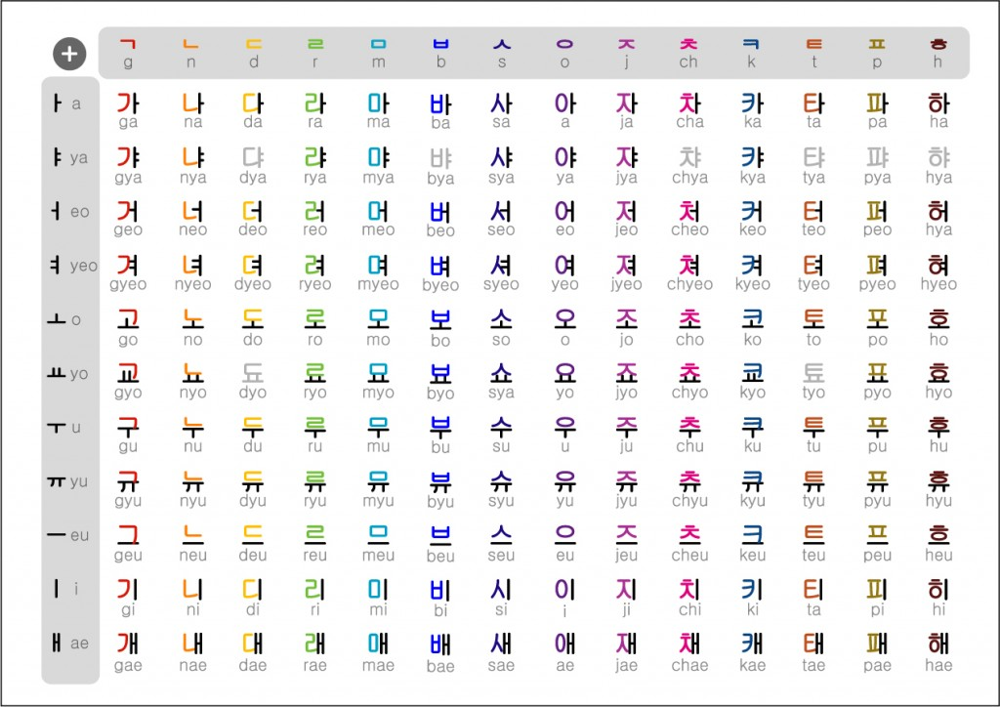
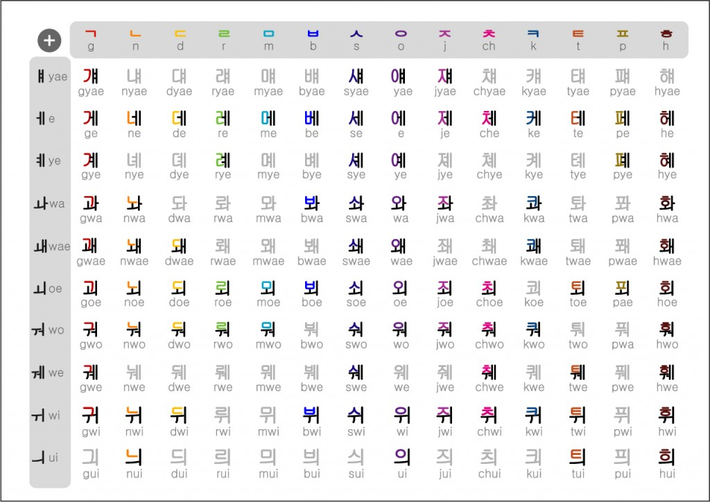
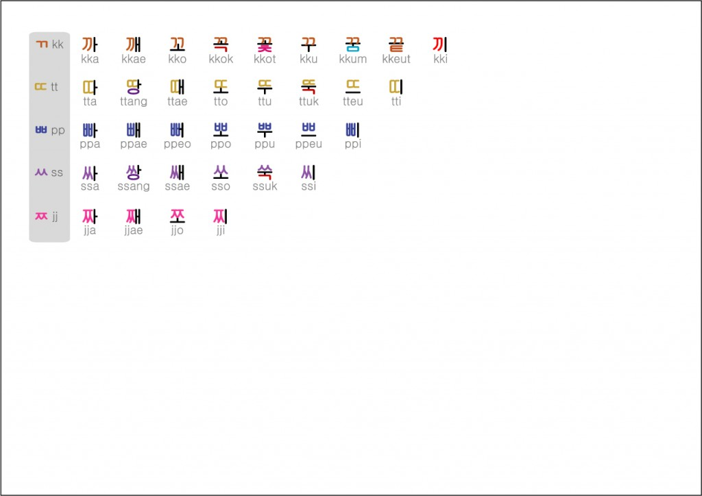
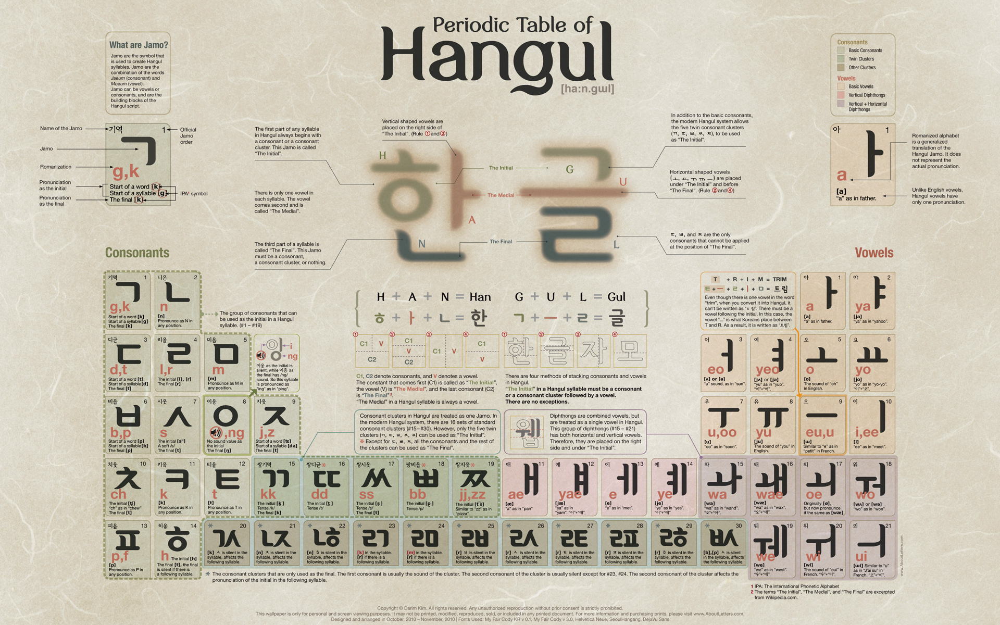
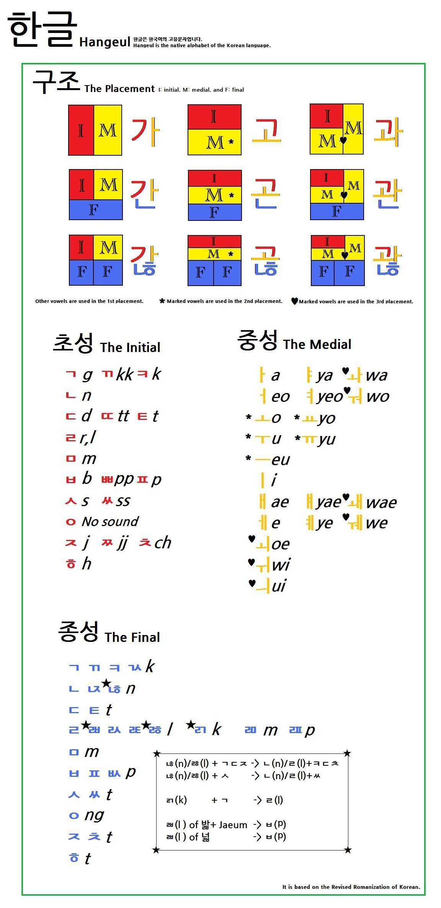
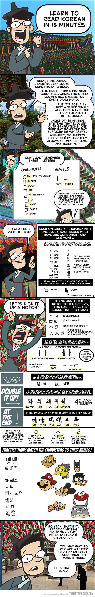

# Language

All the active elements of this style have particular sounds associated with
them. Each combination of stance, grip, guard, and transitions from one to the
other can be represented in both written form, and verbally. It is best to
train the various utterances along-side the components so a rapid pace of
learning can be achieved on both fronts.

The language used for representing the sounds is Hangul, and it can be learned
fairly quickly using the [Learn Hangul in 20min][1] guide, or by utilising the
following resources:

## Reference Charts

## Reference Posters

## Introduction Comic

[1]: http://josefwigren.com/hangul-in-20-minutes/

